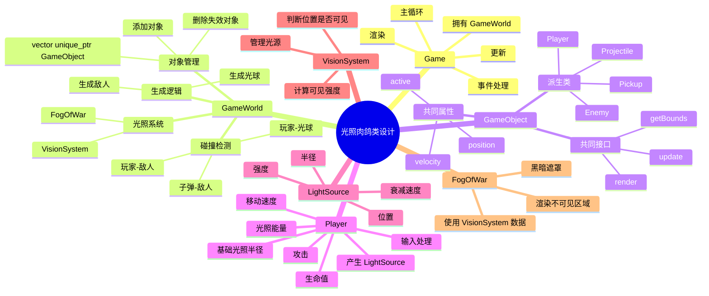

# 光照肉鸽类设计

## 类关系思维导图

```mermaid
mindmap
  root((光照肉鸽类设计))
    Game
      主循环
      事件处理
      更新
      渲染
      拥有 GameWorld
    GameWorld
      对象管理
        vector unique_ptr GameObject
        添加对象
        删除失效对象
      碰撞检测
        玩家-敌人
        子弹-敌人
        玩家-光球
      生成逻辑
        生成敌人
        生成光球
      光照系统
        VisionSystem
        FogOfWar
    GameObject
      共同属性
        position
        velocity
        active
      共同接口
        update
        render
        getBounds
      派生类
        Player
        Enemy
        Projectile
        Pickup
    Player
      生命值
      移动速度
      光照能量
      基础光照半径
      输入处理
      攻击
      产生 LightSource
    LightSource
      位置
      半径
      强度
      衰减速度
    VisionSystem
      管理光源
      判断位置是否可见
      计算可见强度
    FogOfWar
      黑暗遮罩
      渲染不可见区域
      使用 VisionSystem 数据
```